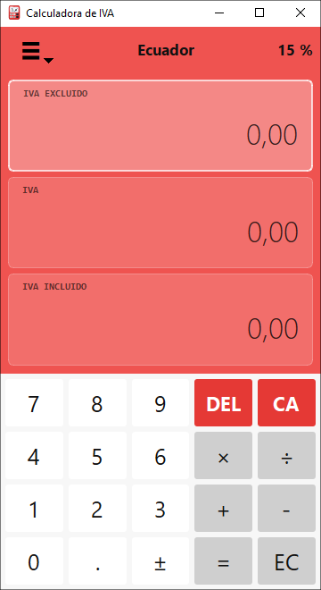

# Lucio IVA Calculator

[](https://github.com/wachin/lucio-iva-calculator/actions/workflows/build.yml)
[](https://wachin.github.io/lucio-iva-calculator/)
[](https://www.python.org/)
[](https://www.riverbankcomputing.com/software/pyqt/)
[](LICENSE)
[](#run-from-source)

Desktop VAT calculator made with PyQt6 and inspired by VAT Calculator.

Spanish README: [README_ES.md](README_ES.md)

## Features

- Three synchronized displays: VAT excluded, VAT, and VAT included.
- Numeric keypad with basic operations, delete, clear, and sign toggle.
- Country/rate selection with rates for Ecuador, the European Union, and other countries.
- Persistent custom rates.
- Numeric format settings: separators, decimals, and digit grouping.
- Color themes.
- Selectable interface size: very small, small, medium, large, and very large.
- Internationalization with Qt Linguist: System option and multiple languages.
- When the language changes, the app automatically suggests the rate for the associated country; the user can change it later.
- Local bilingual help in English and Spanish.
- Keyboard shortcuts and physical numeric keypad support.

## Available Languages

The application includes the `System` option, which uses the operating system language when it is supported. English is the built-in base language, and the other languages, including Spanish, are loaded from compiled Qt `.qm` files.

Available interface languages:

| Code | Language |
| --- | --- |
| `system` | System language |
| `es` | Spanish |
| `en` | English |
| `de` | German |
| `fr` | French |
| `it` | Italian |
| `pt` | Portuguese |
| `nl` | Dutch |
| `pl` | Polish |
| `ro` | Romanian |
| `bg` | Bulgarian |
| `hr` | Croatian |
| `cs` | Czech |
| `sk` | Slovak |
| `sl` | Slovenian |
| `et` | Estonian |
| `fi` | Finnish |
| `sv` | Swedish |
| `da` | Danish |
| `el` | Greek |
| `hu` | Hungarian |
| `lv` | Latvian |
| `lt` | Lithuanian |
| `mt` | Maltese |
| `no` | Norwegian |
| `ja` | Japanese |
| `ko` | Korean |
| `zh` | Chinese |
| `hi` | Hindi |

## Basic Usage

1. Select a rate from the country name, percentage, or menu.
2. Click `VAT excluded`, `VAT`, or `VAT included` to choose which value you want to edit.
3. Enter the amount with the on-screen keypad or a physical keyboard.
4. The other two displays update automatically using the active rate.

You can create custom rates for discounts, fees, commissions, or other taxes. In `Settings` you can change the language, numeric format, visual theme, and interface size.

## Keyboard Shortcuts

| Shortcut | Action |
| --- | --- |
| `0-9` | Enter numbers |
| `. / ,` | Enter decimal separator |
| `+ - * /` | Basic operations |
| `Enter` | Calculate pending operation |
| `Backspace / Delete` | Delete last digit |
| `Esc` | Clear all |
| `Ctrl+1` | Edit VAT excluded |
| `Ctrl+2` | Edit VAT |
| `Ctrl+3` | Edit VAT included |
| `Ctrl+Tab` | Switch to next value |
| `Ctrl+Shift+Tab` | Switch to previous value |
| `Ctrl+P` | Select country |
| `Ctrl+R` | Open custom rates |
| `Ctrl+,` | Open settings |
| `F1` | Open help |

## Run From Source

Lucio IVA Calculator can run directly from this source code folder. You do not need to build it or create an installer to test it.

### Windows 10/11 Without venv

If Python is installed and available in `PATH`, install the dependencies and run:

```powershell
pip install -r requirements.txt
python main.py
```

On many Windows installations this also works:

```powershell
py -m pip install -r requirements.txt
py main.py
```

### Linux Without venv

On Debian, Ubuntu, MX Linux, and derivatives you can use the system packages:

```bash
sudo apt update
sudo apt install python3-pyqt6
```

### Run on Linux

```bash
python3 main.py
```

If your distribution does not provide `python3-pyqt6`, or if you prefer to use `pip`, install:

```bash
python3 -m pip install -r requirements.txt
python3 main.py
```

### macOS From Source

Do not rely on the old system Python. Install Python 3 with Homebrew or from python.org, then run:

```bash
python3 -m pip install -r requirements.txt
python3 main.py
```

### Windows With venv for Development

Using `venv` is not required, but it is recommended if you are developing, testing dependencies, or packaging:

```powershell
python -m venv .venv
.\.venv\Scripts\Activate.ps1
python -m pip install --upgrade pip
pip install -r requirements.txt
python main.py
```

If PowerShell blocks environment activation, you can use:

```powershell
.\.venv\Scripts\python.exe -m pip install -r requirements.txt
.\.venv\Scripts\python.exe main.py
```

### Linux With venv for Development

```bash
python3 -m venv .venv
source .venv/bin/activate
python -m pip install --upgrade pip
pip install -r requirements.txt
python main.py
```

The program will launch.



---

## Building on Debian 12 (Recommended for Linux Releases)

To maximize compatibility with Debian-based distributions, we recommend building Linux binaries on Debian 12 (Bookworm) or MX Linux 23.

### Why Debian 12?

PyInstaller bundles the Python interpreter and links against system libraries available on the build machine. If the application is built on a newer distribution (for example Ubuntu 24.04, Ubuntu 26.04, Fedora 40+, etc.), the generated executable may require newer versions of GLIBC that are not available on older systems.

Typical error:

```text
Failed to load Python shared library ...
GLIBC_2.38 not found
```

Building on Debian 12 avoids this issue because Debian 12 ships with GLIBC 2.36, which is compatible with many current Linux distributions.

### Install dependencies

```bash
sudo apt update

sudo apt install -y \
    python3 \
    python3-venv \
    python3-pip \
    pyqt6-dev-tools
```

### Create a virtual environment

```bash
python3 -m venv venv
source venv/bin/activate
```

### Install Python requirements

```bash
pip install --upgrade pip
pip install -r build/requirements-linux.txt
```

### Build the application

```bash
chmod +x build/build_linux.sh
./build/build_linux.sh
```

The executable will be generated in:

```text
build/dist/LucioIVACalculator
```

The Linux release archive will be generated in:

```text
build/output/LucioIVACalculator-<version>-linux.tar.gz
```

For local Debian 12 builds intended to distinguish the package from newer-distribution Linux builds, you can pass `debian12` as an argument:

```bash
echo 0.1.1 > VERSION
./build/build_linux.sh debian12
```

That produces:

```text
build/output/LucioIVACalculator-0.1.1-linux_debian12.tar.gz
```

This is useful when you want to keep the standard `-linux.tar.gz` name for GitHub Actions or modern Linux builds, while generating a clearly labeled Debian 12 compatible package locally.

### Verify compatibility

After building, you can inspect the GLIBC requirements:

```bash
strings build/dist/LucioIVACalculator | grep GLIBC_
```

The generated binary should not require a newer GLIBC version than the one available on Debian 12.

### Recommended build environments

* Debian 12 (Bookworm)
* MX Linux 23
* Debian 12 Docker container
* Debian 12 virtual machine

Avoid building release binaries on very recent distributions if you want compatibility with older Linux systems.

### Linux desktop integration

`build/build_linux.sh` now copies these extra files to `build/dist/`:

* `LucioIVACalculator.desktop`
* `app-icon.svg`

The executable already sets the Qt runtime icon with `QApplication.setWindowIcon()` and `setWindowIcon()` on the main window, but many Linux desktop environments still prefer a matching `.desktop` entry for the Dock, application menu, launchers, and sometimes Alt+Tab. This is especially common with PyInstaller `--onefile`, because the extracted runtime path is temporary and desktop shells rely on a stable application identity instead of filesystem heuristics.

The desktop entry uses:

* `Exec=LucioIVACalculator`
* `Icon=LucioIVACalculator`
* `StartupWMClass=LucioIVACalculator`

That matches the Qt desktop file name configured at runtime and helps GNOME, KDE, XFCE, Debian 12, MX Linux 23, Ubuntu 24.04+, and Ubuntu 26.04 associate the window with the correct launcher icon.

For a per-user installation, copy the files to standard locations:

```bash
mkdir -p ~/.local/bin ~/.local/share/applications ~/.local/share/icons/hicolor/scalable/apps
cp build/dist/LucioIVACalculator ~/.local/bin/
cp build/dist/LucioIVACalculator.desktop ~/.local/share/applications/
cp build/dist/app-icon.svg ~/.local/share/icons/hicolor/scalable/apps/LucioIVACalculator.svg
chmod +x ~/.local/bin/LucioIVACalculator
```

If `~/.local/bin` is not already in `PATH`, either add it or edit `Exec=` inside the desktop file to the absolute executable path.

After copying, the application should appear in the applications menu and use the installed icon instead of behaving like a purely portable binary launched from an arbitrary folder.

---

## Configuration

The app stores its preferences in an INI file inside the user's configuration folder:

- Windows: `%AppData%\Lucio\IVA Calculator.ini`
- Linux: `~/.config/Lucio/IVA Calculator.ini`
- macOS: `~/Library/Application Support/Lucio/IVA Calculator.ini`

## Customizing Colors

The main visual colors are in `main.py`.

To change the base color for each theme, edit the `THEMES` dictionary. For example, the dark theme uses:

```python
"Oscuro": "#3d3d3d"
```

To specifically change the background of the `VAT EXCLUDED`, `VAT`, and `VAT INCLUDED` sections in dark mode, search for these variables inside `apply_theme()`:

```python
panel_background = "#2f2f2f" if dark_theme else "rgba(255,255,255,0.16)"
active_panel_background = "#383838" if dark_theme else "rgba(255,255,255,0.31)"
panel_border = "#666666" if dark_theme else "rgba(255,255,255,0.28)"
```

`panel_background` controls normal panels, `active_panel_background` controls the selected panel, and `panel_border` controls the border.

## Translations

The editable Qt Linguist files are in:

```text
translations/*.ts
```

The `System` option uses the operating system language. If the locale includes a country, it also tries to select the matching rate, for example `es_EC` uses Ecuador and `pt_BR` uses Brazil.

To compile `.ts` files to `.qm` on Windows:

```powershell
powershell -NoProfile -ExecutionPolicy Bypass -File .\scripts\compile_translations.ps1
```

The script searches for `lrelease.exe` in `PATH`, PyQt6, `QTDIR`, `C:\Qt`, and `%USERPROFILE%\Qt`.

### Qt Creator and lrelease on Windows

To edit or recompile translations on Windows, it is best to install Qt with the official online installer:

- [Qt Online Installer (Open Source)](https://www.qt.io/development/download-qt-installer-oss)

Installing Qt Creator alone is not always enough. To get `lrelease.exe`, install at least one full desktop kit from Qt Maintenance Tool, for example:

```text
Qt -> Qt 6.x.x -> MinGW 64-bit
```

or:

```text
Qt -> Qt 6.x.x -> MSVC 64-bit
```

Then `lrelease.exe` is usually located in paths like:

```text
C:\Qt\6.x.x\mingw_64\bin\lrelease.exe
C:\Qt\6.x.x\msvc*_64\bin\lrelease.exe
```

You can check with:

```powershell
Get-ChildItem C:\Qt -Recurse -Filter lrelease.exe
```

If `lrelease.exe` exists but is not in `PATH`, that is okay: `scripts\compile_translations.ps1` also searches in `QTDIR`, `C:\Qt`, and `%USERPROFILE%\Qt`.

The GitHub Actions Windows build installs Qt explicitly for translation compilation, so the Windows build dependencies only include the runtime/build Python packages required by the application and Nuitka.

## Cross-platform Builds

The project includes GitHub Actions to build artifacts on Windows, Linux, and macOS:

```text
.github/workflows/build.yml
```

The build scripts are in:

```text
build/build_windows.ps1
build/build_linux.sh
build/build_macos.sh
```

Windows artifacts are built with Nuitka. Linux and macOS artifacts continue to use their platform build scripts shown above.

### Windows installer and portable package

The Windows build generates two files:

```text
build/output/LucioIVACalculator-<version>-setup.exe
build/output/LucioIVACalculator-<version>-Windows-x64-portable.zip
```

The `setup.exe` installer installs the application under the current user's profile and can create Start Menu/Desktop shortcuts. The portable ZIP does not install anything: extract it and run:

```text
LucioIVACalculator/LucioIVACalculator.exe
```

GitHub Actions uploads both files in the `lucio-iva-windows` artifact and also attaches both to tagged releases. The Windows smoke test verifies both the installed application and the portable executable with `--smoke-test`.

The portable ZIP is useful for users who do not want an installer and for comparing antivirus results in services such as VirusTotal. Windows release artifacts are built with Nuitka and NSIS, generated from GitHub Actions, and published with checksums when possible.

Mini checklist for creating a GitHub release:

```text
docs/github_release_checklist_en.md
```

To publish a version, update `VERSION`, create a tag with the format `v0.1.2`, and push it to GitHub:

```bash
git tag v0.1.2
git push origin v0.1.2
```

The workflow creates a release with the Windows, Linux, and macOS artifacts. Tagged releases also include `SHA256SUMS.txt` so users can verify downloaded files.
